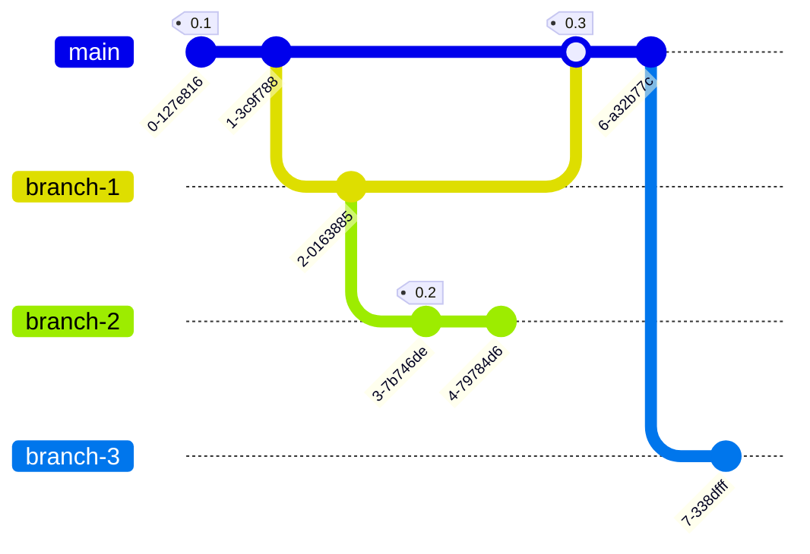

# Git basics

> :warning: This is meant as an introduction for practical use, targeting beginners, not as an extensive list of possible commands for advanced users.

1. [Local / remote repositories](#local--remote-repositories)
2. [Working on local repository, easy mode](#working-on-local-repository-easy-mode)
3. [Branches and tags](#branches-and-tags)
4. [Working on local repository, intermediary mode](#working-on-local-repository-intermediary-mode)
5. [Best practices](#best-practices)

## Local / remote repositories

:point_up: Remote repository may make it look like it's all centralised, but it's actually peer-to-peer.

* Initialise a local repository: `git clone <uri>`
* Display history: `git log --graph --oneline --color --decorate --all`
* Check synchronisation with remote repository: `git status`
* Display delta with remote repository: `git diff`
* Fetch changes from remote repository: `git pull --rebase`
* Publish local changes to remote repository: `git push`
* Overwrite remote repository: `git push --force-with-lease` :warning:

## Working on local repository, easy mode

Never alter past commits, work in an append-only fashion. This is the easy mode.

* Stage changes for next commit: `git add <path>`
* Commit staged changes: `git commit`
* Add commit that reverts another commit: `git revert <hash>`

## Branches and tags

Branches and tags are basically pointers to a specific commit.

* Create a new branch: `git branch <branch name>`
* Switch to specified branch: `git checkout <branch name>`
* Catch up with main branch: `git rebase main`
* Integrate changes from specified branch: `git merge` / `git merge --no-ff` (see [Merge strategy](#merge-strategy))
* Tag latest commit: `git tag <tag name>`
* Integrate commit from another branch: `git cherry-pick <hash>`

## Working on local repository, intermediary mode

The easy mode is nice and simple, but it is likely to result in a messy history.
Altering past commits is something you should allow, provided you use it appropriately.

* Each commit is identified by a hash.

* When you add a commit, previous commits do not change.

* When you alter a past commit, you actually create a new commit from it, with a distinct hash. And every subsequent commit is copied as well.
  Do former commits disappear? No, but it is pretty much the same, as they are merely not part of the branch anymore. 

* Amend last commit: `git commit --amend`
* Delete commits after specified commit (changes are preserved, but uncommitted) : `git reset <hash>`
* Delete uncommitted changes: `git reset --hard`

## Best practices

* Never use `push --force` on `main` branch.
* Except for `main`, keep branches short-lived.
* Frequently rebase branches in order to prevent conflicts from escalating.
* Always rebase before merging in order to keep a linear history.
* Check out [Trunk-Based Development](https://trunkbaseddevelopment.com) for more.
