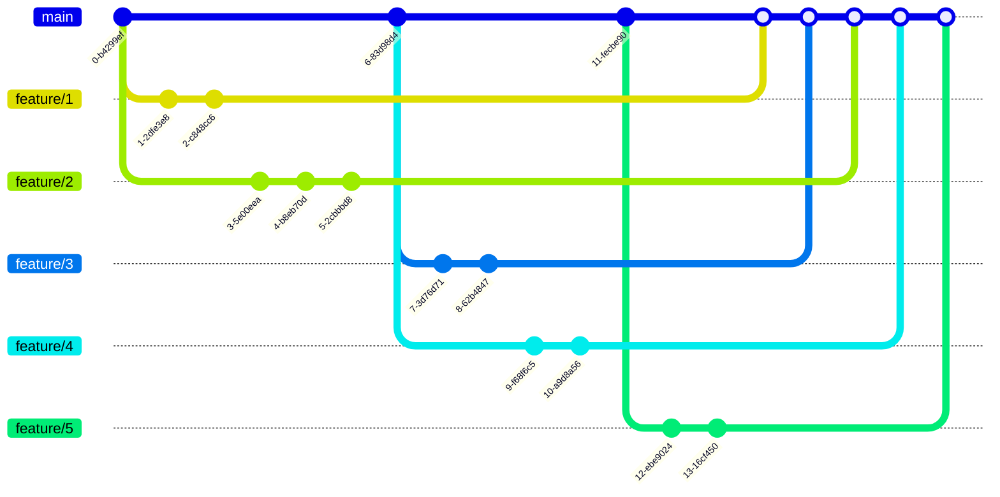

# Merge strategies

## Context

You want to merge `feature/2`, then `feature/1`. Easy, but there are multiple ways you can do it.

## Options

### Merge commit

`git merge --no-ff`

However, after a while, your Git history is likely to turn into a subway map:

Now why would that be a problem?

* Solving conflicts becomes extra hard when you fail to picture what is going on. How can you check everything went fine if you don't know what fine is?
* This is hard to navigate, even for robots. On the contrary, a linear history makes it possible to use some nice commands like `git bisect`.

### Merge commit with rebase (semi-linear history)

`git rebase && git merge --no-ff`

### Fast-forward merge (linear history)

`git rebase && git merge`

### To squash or not to squash?

Some like to keep intermediary commits, some don't. It mostly depends on team practices, especially regarding PR atomicity and code review.

## Configuration for Gitlab

<picture>
  <source media="(prefers-color-scheme: light)" srcset="img/light-gitlab_merge_config.png" />
  
</picture>

## Configuration for GitHub

<picture>
  <source media="(prefers-color-scheme: light)" srcset="img/light-github_merge_config.png" />
  
</picture>

1 Is PR split into commits supposed to help people review it? Or is it supposed to remain relevant even after the branch has been merged? For instance, do you have commits like "take PR comments into account"?

2 If the team is mature enough, you can let developers choose whether they need to squash or not. But if it is not, you may want to avoid this additional source of mistakes.
